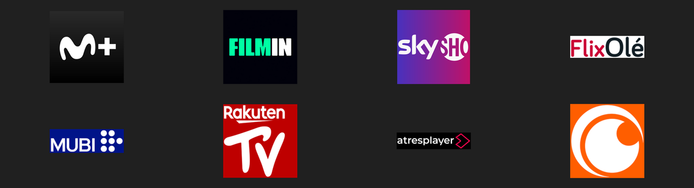

# Nuvio badges: Spanish streaming services

Fusion badge rules for Nuvio covering the services people in Spain actually
subscribe to. No other published pack carries any of them.

Movistar Plus+ · Filmin · SkyShowtime · FlixOlé · MUBI · Rakuten TV ·
Atres Player · Crunchyroll

| Mono | Colour |
| --- | --- |
|  |  |

## Which file

| File | Badges | Use it when |
| --- | --- | --- |
| `badges-es-mono.json` | 8 | White on transparent, to sit beside a monochrome pack. |
| `badges-es-color.json` | 8 | Full-colour service tiles. |
| `badges-all.json` | 56 | One URL instead of two: a complete pack with these eight folded in. |

Nuvio accepts three Fusion badge URLs, so either eight-badge variant drops in
beside the pack you already run. Paste the raw URL under Streams, Fusion badge
URLs.

```
https://raw.githubusercontent.com/hxreborn/nuvio-badges-es/main/badges-es-mono.json
https://raw.githubusercontent.com/hxreborn/nuvio-badges-es/main/badges-es-color.json
https://raw.githubusercontent.com/hxreborn/nuvio-badges-es/main/badges-all.json
```

## What the rules match

Each rule matches the service name in a stream row's text, so the row has to
name the service for the badge to draw. Reseller and ad-tier strings resolve to
the parent service, so `Movistar Plus+ Ficción Total` badges as Movistar and
`Filmin Plus` as Filmin.

`badges-all.json` also repairs the upstream Crunchyroll rule. The original is
`\bcrunch\b`, which requires `crunch` as a whole word and so never fires on
`Crunchyroll`.

## Artwork

600x300 PNG. The mono set is white on transparent; the colour set keeps the
service's own tile. Both derive from the provider logos TMDB publishes.

## Rebuilding

```sh
node build.js https://raw.githubusercontent.com/hxreborn/nuvio-badges-es/main
node merge.js https://raw.githubusercontent.com/hxreborn/nuvio-badges-es/main
```

Both scripts self-test and exit non-zero on failure: every service name must
light exactly one badge, no global service may leak into a Spanish rule, the
reseller strings must resolve to their parent, every referenced image must
exist, and filter ids must stay unique.

## Credit

- [Badger](https://nintle.github.io/Badger/) by Nintle, the editor these files target.
- `badges-all.json` builds on `badges-mono.json` from
  [chreid1973/3hpm-nuvio-wizard](https://github.com/chreid1973/3hpm-nuvio-wizard),
  whose artwork comes from
  [9mousaa/BetterFormatter](https://github.com/9mousaa/BetterFormatter) and
  [je19921/cardgenerator.github.io](https://github.com/je19921/cardgenerator.github.io).
- Provider logos from [TMDB](https://www.themoviedb.org/). This project is not
  endorsed or certified by TMDB.
