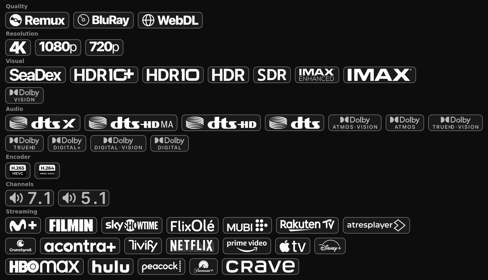

# Nuvio Streaming Badges

A minimalist badge set for Nuvio:
[chreid1973/3hpm-nuvio-wizard](https://github.com/chreid1973/3hpm-nuvio-wizard)
plus 9 new streaming services: Filmin, FlixOlé, Movistar Plus+, SkyShowtime,
Atres Player, Acontra Plus, Tivify, MUBI and Rakuten TV.



Each badge in the JSON is a regex. Nuvio runs it over the stream's description
and draws the badge on a match:

```
🍿 FILMIN      (?i)\bfilmin(?:[\s._-]?plus)?\b
🍿 SKYSHOWTIME (?i)\bsky[\s._-]?showtime\b
```

Every rule is reviewed against upstream, and the broken ones fixed.

A streaming badge needs the service named in the description, so your addon has
to put it there.

## Setup

1. Import a badge set in Nuvio, under Streams, Fusion badge URLs. Nuvio holds
   three URLs but runs one at a time, so use the complete pack:

   ```
   https://raw.githubusercontent.com/hxreborn/nuvio-streaming-badges/main/badges-all.json
   ```

   |                              |                                                                     |
   | ---------------------------- | ------------------------------------------------------------------- |
   | `badges-all.json`            | the whole pack, 58 badges                   |
   | `badges-streaming-mono.json` | the 19 services on their own                |

2. Check your addon puts the service name in the stream description. Without it
   no streaming badge ever fires.

## Artwork

Every image is hosted here, so nothing breaks if a source repo moves. The new
logos are white on transparency, 160 px tall and trimmed to the mark, so width
varies with the logo.

| Badges | Art by |
| --- | --- |
| Netflix, Prime Video, Apple TV+, Disney+, HBO Max, Hulu, Peacock, Paramount+, Crave, Crunchyroll | [je19921](https://github.com/je19921/cardgenerator.github.io) |
| Atres Player, Movistar Plus+, MUBI, Rakuten TV, SkyShowtime | [Wikimedia Commons](https://commons.wikimedia.org/wiki/Category:SVG_logos_of_video_streaming_services) |
| Filmin, FlixOlé, Acontra Plus, Tivify | [filmin.es](https://www.filmin.es/), [flixole.com](https://www.flixole.com/), [acontraplus.com](https://www.acontraplus.com/), [tivify.es](https://www.tivify.es/) |
| the other 29 | [9mousaa](https://github.com/9mousaa/BetterFormatter) and [je19921](https://github.com/je19921/cardgenerator.github.io) |

Editor: [Badger](https://nintle.github.io/Badger/) by Nintle. Trademarks belong
to their owners; this project isn't endorsed by any of them.
